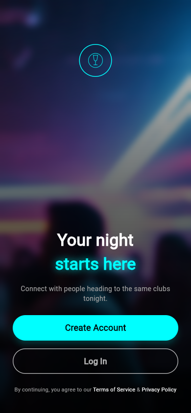
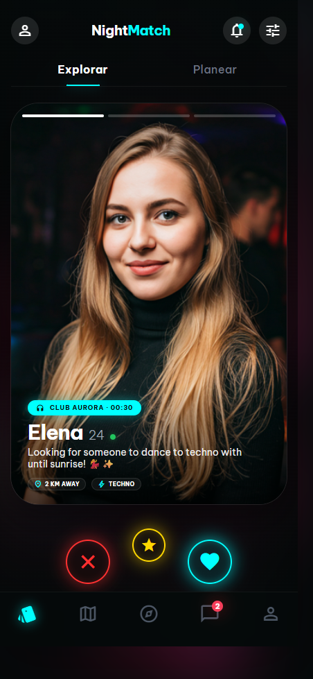
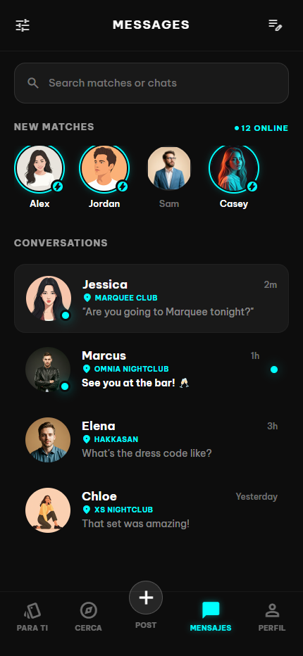
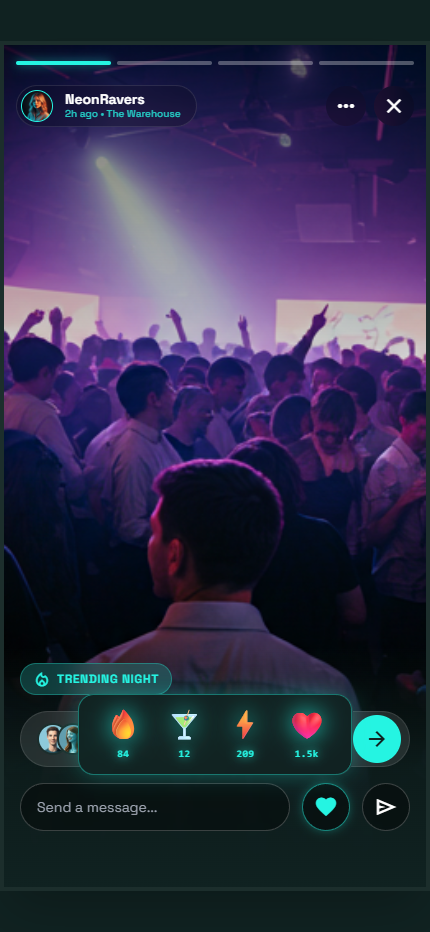
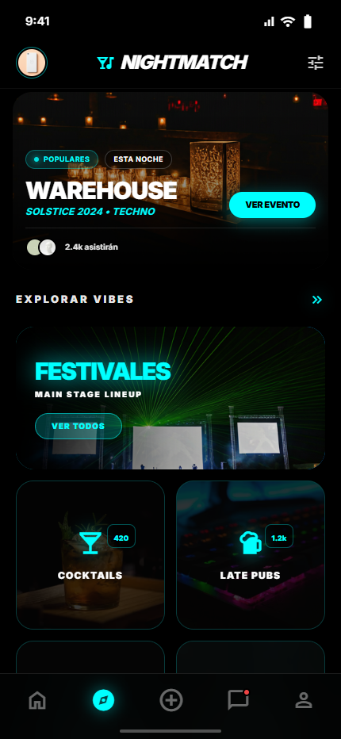

# NightMatch

NightMatch es un prototipo Flutter de pantalla inicial para una app social orientada a planes nocturnos. El repositorio contiene una experiencia visual de bienvenida con estética neon, fondo con blur, botones de acceso y sistema de diseño básico.

## 🚀 Demo

> Actualmente no hay una demo pública disponible. El proyecto puede ejecutarse en local siguiendo las instrucciones de instalación.

> Para probar la aplicación en un dispositivo Android, se puede generar un APK siguiendo los pasos indicados en la sección de instalación.

## 📸 Capturas







## 🧩 Funcionalidades

* Pantalla de bienvenida con imagen de fondo.
* Efecto blur sobre la imagen principal.
* Degradado oscuro para mejorar la lectura del contenido.
* Icono SVG en estilo neon.
* Botones visuales de `Create Account` y `Log In`.
* Texto legal de términos y privacidad.
* Tokens de diseño para colores, tipografía, espaciado, sombras y bordes.
* Tema oscuro definido en `lib/app/design/theme.dart`.

Los botones de registro e inicio de sesión no tienen navegación o lógica implementada todavía.

## 🛠️ Tecnologías utilizadas

**Mobile**

* Flutter
* Dart
* Material Design

**Librerías**

* `flutter_svg`

**Assets**

* `assets/images/night_bg.png`
* `assets/icons/glass_neon.svg`

## 🏗️ Arquitectura y estructura

```text
nightmatch/
├── assets/
│   ├── icons/
│   └── images/
├── lib/
│   ├── app/
│   │   └── design/
│   ├── main.dart
│   └── welcomeScreen.dart
├── pubspec.yaml
└── README.md
```

## ⚙️ Instalación y ejecución

```bash
flutter pub get
flutter run
```

Para generar un APK de Android:

```bash
flutter build apk --release
```

## 🧪 Tests

> Actualmente no se han detectado tests automatizados en el repositorio.

## 📦 Build o despliegue

```bash
flutter build apk --release
```

## 📌 Estado del proyecto

Prototipo visual en desarrollo.

Posibles mejoras futuras:

* Conectar los botones a pantallas reales de login y registro.
* Aplicar el tema definido en `theme.dart` desde `MaterialApp`.
* Añadir capturas de pantalla.
* Añadir tests de widget para la pantalla inicial.
* Revisar textos y comentarios con problemas de codificación.

## 👨‍💻 Autor

Lorenzo Bellido Barrena

* Portfolio: https://lorenzo-bellido.vercel.app/
* LinkedIn: https://www.linkedin.com/in/lorenzo-bellido-barrena/
* GitHub: https://github.com/LorenzoBellidoBarrena
* Email: [lorenzobeba2@gmail.com](mailto:lorenzobeba2@gmail.com)
